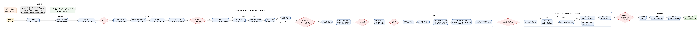

# MM-Final-Skill

**数学建模里最好的、也是最后一个 skill。** 把一道数模赛题（题目 PDF + 附件）丢给它，它在本机跑完读题 → 战略锦标赛 → 建模求解 → 红队独立复算 → 图证 → 撰稿 → 四轮审稿场 → 出版门 → 终审出版复盘，交出一篇可提交的论文：PDF、全套 LaTeX、图、求解脚本、交接与审稿记录、复盘报告。17 条角色腿各司其职，操盘手（你，或者 Claude Code / Codex）只负责体检、开炉、盯、插手、收尾——不写论文、不手工解题。

本仓库三件东西：
1. **流水线本体** `流水线/`：驱动 `蜂群驾驶.py`、本地蜂巢、17 个角色提示词、门/守卫/台账/契约核对、干跑验证。
2. **操盘 skill 两个版本** `发布/paper-foundry-claude`（Claude Code 操盘，角色腿是 `claude -p` 子代理）与 `发布/paper-foundry-codex`（Codex 操盘，角色腿是 `codex exec`）。核心在 `.claude/skills/paper-foundry`。
3. **参考论文** `参考论文/2025国赛B_对照版/`：2025 年全国大学生数学建模竞赛 B 题，411 条腿、26.7 小时机时跑出的 66 页成品与全部中间产物。

---

## 0 先看这个：推荐模型与渠道

| 项 | 推荐 | 说明 |
|---|---|---|
| **模型** | **Astra（`gpt-6-astra`）** | 本仓库全部量级数据、参考论文、阈值校准都来自它。角色分档：算/证/裁 xhigh，写/审 high，看图/读者/复盘 medium。 |
| **渠道** | **`api.timoz.me`** —— 官转 API 渠道，速度快、稳定不降质 | 2025 国赛 B 对照跑 411 条腿 / 26.7 h 全程走这个渠道。并发闸建议 4（6 并发曾整晚触发 429 限流，驱动会自动降到 4）。 |
| 备选引擎 | Claude Code（`claude -p`） | 用你自己的 Claude Code 登录态；同一套角色提示词与分档表，见 §3。 |

**Codex 引擎配置示例**（`~/.codex/config.toml`，本仓库任何文件都不会读、写、打印它；密钥永远只放这里）：

```toml
model = "gpt-6-astra"
model_provider = "astra"
model_reasoning_effort = "xhigh"

[model_providers.astra]
name = "Astra 官转（api.timoz.me）"
base_url = "https://api.timoz.me/v1"
env_key = "ASTRA_API_KEY"        # 密钥放环境变量，不写进任何仓库文件
```

字段以渠道文档与你本机 codex 版本为准（`codex-cli 0.153.0` 实测可用）。开炉前 `bash .claude/skills/paper-foundry/scripts/体检.sh` 只检查这个文件是否存在，不看内容。

---

## 1 它到底做了什么



| 阶段 | 做什么 | 门 | 角色 |
|---|---|---|---|
| S0 吃透题目 | 播种工作根 → 读题体检 → 答卷预测与需求追踪矩阵 | G0 题面契约/数据档案机械项 | 读题官、答卷预测官 |
| S1 战略锦标赛 | 侦察 → 每问 N 条路线跑小样原型 → 裁决 → 定稿 | G1 | 规划师、建模师 |
| S2 建模求解 | 依赖 DAG 分层；每问 建模 → **红队独立复算**（禁读建模代码）→ 不齐则仲裁 → 解读 | G2:问N（答案门 + 解读 PASS）：返工 ≤2 → 升格蜂群 → 降级放行 | 建模师、红队、解读师 |
| S3 图证 | 绘图 → 图评循环 | G3 | 绘图师、图评师 |
| S4 撰稿 | 叙事底稿 → 主控/脊柱 → 撰稿 → 章评循环（章评 + 闭卷读者 → 按分选章修订 → 变化守卫）→ 统稿 → 摘要蜂群（N 变体 + 复述门） | G4 | 撰稿师、章评师、读者、统稿师 |
| S5 审稿场 | 每轮：编译 → 渲染页 → 审计 → 门检 → 审 A / 审 B / 硬伤猎手 / 评委模拟（看页图）→ 合并裁定 → 台账并入 → 收敛判定 → 熔断 → 回炉（算 → 图 → 文） | 逐轮门检 | 审稿员、硬伤猎手、评委模拟、建模师、绘图师、撰稿师 |
| S5a/S5b | 摘要定稿（复述门）→ 美化循环（图条派绘图师 + 成图脚本，文条派撰稿师）→ 页数守卫 | — | 美化师、绘图师、撰稿师 |
| G5 出版门 | 终编 → 台账视图 → 审计 → 门检；返工 = 图路 → 改文 → 复核前编译 + 页数守卫 → 猎手复核 | G5 | 硬伤猎手、绘图师、撰稿师 |
| S6 出版复盘 | 逐页终审 → 终审整改 → 出版收割 → 复盘官（复盘系统本身，不是复盘论文） | — | 美化师、撰稿师、复盘官 |

几条设计原则，每一条背后都有一次真事故（`病根台账.md` 有 53 条链路病根 + 10 条提示词病根，全部带证据、归属、修法、检测机制）：

- **先算后图后文**：数字变了，图和文必须跟着换版；重算腿产出「换版清单」，猎手按清单 grep 旧值残留。
- **红队独立复算 + 两套口径**：复算腿禁读建模代码与笔记；分歧先分「数值差」还是「口径差」，再裁定。
- **台账是唯一真相**：审稿意见进台账（待改/待复核/已消解/未消解/搁置），同一条目两次修订未消解 → 升格一次 → 搁置交人工，不无限回流。
- **三道守卫**：变化守卫（句子尺、字符丢失比、点名感知）、结构守卫（主控 `\input` 集、空章、附录源码清单不减）、页数守卫（基线 +10%）。腿改坏了会被机械回退，不靠模型自觉。
- **契约核对**：每个消费方读取的 JSON 字段都必须有生产方声明背书，`验证.sh` 里是硬门。
- **干跑验证**：10 个场景（全链 / 中断续跑 / 级联 / 门升格 / 韧性 / S5 续跑 / G5 图路 / G5 算条 / G5 页数 / 引擎）用假蜂巢在 10 秒内跑完整个编排图，改了驱动不过干跑不许续跑。

---

## 2 真跑成绩（2025 国赛 B 题·红外反射谱测外延层厚度）

| 指标 | 对照版（本仓库参考论文） | 骨架版（沙箱 + 旧模型，同尺重评） |
|---|---|---|
| 章评均分 | **7.53** | 6.17 |
| 审稿面板 | **7.43** | 6.27 |
| 美观分 / 页数 | 7.1 / 66 页（正文约 19 页，E=0 Overfull=0） | 4.9 / 30 页 |
| 机时 / 腿数 | 26.7 h（1596 min）/ 411 | 15.0 h / 330 |
| 问题门 | 问 1 PASS、问 2 降级放行、问 3 PASS | 三问降级 |
| 出版门 | 第 3 次 FAIL 后降级放行（一条算路无法在出版前重算） | — |

回流账（跑后 `跑后指标.py` 自动算）：红队↔仲裁 16 次、口径差异裁定 8、门 FAIL 22、派返工 18、升格 2、降级 7、守卫超线 3、转路 28、熔断 9/12、脚本 rc≠0 16、修脚本腿 15。这 26.7 h 里含 20 个链路修复的重做与 13 次停/续；同链路干净一炉估 18–20 h，标准档 12–16 h。

成品与逐条记录：
- 论文：[`参考论文/2025国赛B_对照版/论文/论文.pdf`](参考论文/2025国赛B_对照版/论文/论文.pdf)，说明见该目录 [README](参考论文/2025国赛B_对照版/README.md)
- 交付报告（门史、指标、回流账、需人工关注）：[`真题测试/交付报告_对照版.md`](真题测试/交付报告_对照版.md)
- 跑后指标：[`真题测试/跑后指标_对照版.md`](真题测试/跑后指标_对照版.md)；链路调优分析：[`真题测试/链路调优分析_对照版.md`](真题测试/链路调优分析_对照版.md)

诚实声明：这是一份「带已知阻塞的降级交付」（复盘官原话）。问 2 五折不稳定、问 3 硅第二折未收敛，交付报告 §7–8 逐条列了。它展示的是链路能力与文风水准，不是这道题的标准答案。

---

## 3 两个版本、两种引擎

**宿主**（谁当操盘手）与**引擎**（谁跑角色腿）是两件事，可以交叉。发布版只差默认引擎、安装目标与 SKILL.md 开头的「本版本」段，都由 `scripts/打包.sh` 从核心生成，验证门会核对漂移。

| | `发布/paper-foundry-claude` | `发布/paper-foundry-codex` |
|---|---|---|
| 宿主 | Claude Code（`/paper-foundry-claude`） | Codex（`$paper-foundry-codex`） |
| 默认腿引擎 | `claude -p` 无头子代理：系统提示 = 工作根 AGENTS.md + 角色文件，任务作用户消息，腿内可再开 Agent 子代理 | `codex exec`：提示 = 角色文件 + 任务；seatbelt `workspace-write`，`/tmp` 排除 |
| 文件边界 | `--permission-mode acceptEdits` + 工具白名单，禁 WebFetch/WebSearch（不是硬锁） | seatbelt 硬锁在工作根 |
| 附图腿 | 图路径列进任务，腿用 Read 打开 | `-i 图.png`（≤8 张） |
| 推理档 | `--effort low/medium/high/xhigh`，同一张分档表 | `-c model_reasoning_effort=`，同一张分档表 |
| 鉴权 | 你的 Claude Code 登录态 / `~/.claude/settings.json` | `~/.codex/config.toml`（推荐 Astra + api.timoz.me） |
| 安装 | `bash 发布/paper-foundry-claude/scripts/安装.sh`（只装 `~/.claude/skills/`） | `bash 发布/paper-foundry-codex/scripts/安装.sh`（只装 `~/.codex/skills/`） |
| 实跑记录 | 桩单测 16 项 + 干跑通过；**尚无整炉实跑**（作者本机 CLI 鉴权未就绪），第一炉先 `--档位=快速` | 411 腿 / 26.7 h 全程 |

换引擎：`启动.sh … --引擎=claude|codex`。引擎记进 `状态.json`，续跑沿用；只在开炉/续跑边界换（铁律 20）。

---

## 4 安装（十分钟）

```bash
git clone https://github.com/qybaihe/MM-Final-Skill.git
cd MM-Final-Skill
bash 流水线/运行时/环境就绪.sh          # 幂等：texlive(xelatex)+Fandol 字体、ghostscript、poppler、graphviz、venv 科学栈
# 选一个版本装 skill（或两个都装）
bash 发布/paper-foundry-codex/scripts/安装.sh
bash 发布/paper-foundry-claude/scripts/安装.sh
# 体检：项目/引擎/TeX/venv/字体/磁盘/skill 链接/断点/git，✗ 为硬失败
bash .claude/skills/paper-foundry/scripts/体检.sh 真题测试/成品_新炉
bash .claude/skills/paper-foundry/scripts/体检.sh 真题测试/成品_新炉 --引擎=claude --探针   # Claude 引擎：真调一次 claude -p
```

环境要件与缺了会怎样：`.claude/skills/paper-foundry/references/安装与环境.md`。要求 macOS（脚本按 bash 3.2 写，无 GNU timeout 用 perl 替代），磁盘 ≥20 GB（镜像 1.5 GB + 日志 1 GB / 炉）。

---

## 5 从开炉到交付

```bash
# 输入目录只放题目 PDF + 附件（真题测试/输入 已被 .gitignore 排除）
bash .claude/skills/paper-foundry/scripts/启动.sh 真题测试/输入 真题测试/成品_新炉 --档位=标准 --并发=4 --引擎=codex
bash .claude/skills/paper-foundry/scripts/状态.sh 真题测试/成品_新炉        # 一屏：驱动/引擎/阶段/腿数/门史/活腿/异常计数
bash .claude/skills/paper-foundry/scripts/看守.sh 真题测试/成品_新炉 --秒 900   # 按 WATCH_RE 盯日志
bash .claude/skills/paper-foundry/scripts/停跑.sh 真题测试/成品_新炉        # 干净停：先驱动后腿，整组回收
bash .claude/skills/paper-foundry/scripts/启动.sh 真题测试/输入 真题测试/成品_新炉 --resume   # 断点续跑（S5 有轮级断点）
python3 .claude/skills/paper-foundry/scripts/跑后指标.py 真题测试/成品_新炉   # 回流账 + P 检测 → 交付报告
```

| 档位 | 内容 | 机时（Astra，并发 4） |
|---|---|---|
| 深度（默认） | 摘要变体 5、审稿 4 轮、全员 xhigh | 18–27 h |
| 标准 | 摘要变体 3、审稿 3 轮、角色分档推理档 | 12–16 h（估） |
| 快速 | 冒烟：每个节点各跑一次，锦标赛只开分值最高问 | 用来验链路，不用来交论文 |

操盘手的节奏（skill 里写成了清单）：每 15–30 分钟 `状态.sh`；日志里出现 `!!`、`rc=142`、`孤儿`、`Traceback`、`腿死亡`、`降级放行`、`熔断` 按 `references/监督清单.md` 处置；要改链路走「停 → 改 → 验（`验证.sh --干跑=…`）→ 续」四步，或者用 `切换.sh --标记 <日志标记> --钩子 <脚本>` 等到边界自动切换；跑完按 `references/交付报告模板.md` 的收尾 SOP 出报告。

---

## 6 仓库结构

```
.claude/skills/paper-foundry/   核心 skill：SKILL.md 操盘手册 + 11 份参考（铁律/监督清单/流程与档位/故障手册/切换手册/
                                提示词与回流/角色与契约/经验沉淀/交付报告模板/病根登记/安装与环境）+ 13 个脚本
发布/paper-foundry-claude/      Claude 版（默认引擎 claude）        发布/paper-foundry-codex/   Codex 版（默认引擎 codex，含 agents/openai.yaml）
流水线/蜂群驾驶.py              驱动：S0–S6 编排、门、守卫、台账、回炉、续跑断点、预算护栏
流水线/本地蜂巢.py              腿的拉起/回收/活性检查（setsid 进程组），两种引擎经 LEG_ENGINE 分发
流水线/运行时/                  role.sh / 图片腿.sh / codex公共.sh / claude公共.sh、回路（台账）、统稿守卫、门检、审计、契约表/契约核对、
                                环境就绪.sh、模板与范文锚点
流水线/角色/                    17 个角色提示词（P1–P10 收紧条款在末尾，只追加不删旧条）
流水线/验证/                    驱动干跑（10 场景）、角色冒烟、腿引擎分发、各单测
参考论文/2025国赛B_对照版/      参考论文与全部中间产物（裁掉候选转储/页图，41 MB）
真题测试/                       交付报告、跑后指标、链路调优分析、运行报告；成品/镜像/输入 均被 .gitignore 排除
病根台账.md / 施工日志.md       每个链路病根与每张工单的闭环记录（有证据、有检测机制、不闭环不删）
参考项目/                       方法库 HMML 与 MM-Agent 关键源码节选（见 §9 致谢）
```

---

## 7 提示词层：怎么降低回流重做

角色提示词不是一次写完的。对照跑复盘出 10 条「换个地方还会再犯」的提示词病根（P1–P10），全部以**追加条款**落地并做了单腿冒烟：

| 编号 | 病根 | 落地 |
|---|---|---|
| P1 | 红队与建模师口径不一致，把口径差当数值差 | 红队报告写两套口径、结论只按声明口径判；解读师口径说明固定四段 |
| P2 | 返工单不分实现级/方法级，同一参数微调反复 FAIL | 返工单带 `层级: 实现|方法`，连续两轮 FAIL 判方法级 |
| P3 | 重算后图文旧值残留 | 重算腿产出 `换版清单`，猎手逐项 grep |
| P4 | 审稿指令要求整章重写、体量失控 | 指令写法纪律：定位到文件:句、最小改动；撰稿师体量 ≤60 行 |
| P5 | 版式问题混进正确性问题 | 评委/审稿员意见带 `级别: 正确性|版式` |
| P6 | 美化师图类意见派给撰稿师 | 意见带 `目标: 图|文`，图条直派绘图师 + 成图脚本 |
| P7 | 章评不限量不分级，轮 2 重复轮 1 | 每章 ≤5 条、`[严重度1–3]`、轮 ≥2 只评改动段 |
| P8 | 脚本自检写成致命断言、腿内用裸 python | 自检不致命只落 JSON、只用 venv python3、成图脚本不覆盖 MPLCONFIGDIR |
| P9 | 猎手按旧 PDF 判 | 写明依据的 PDF 修改时间与物理页 |
| P10 | 复盘官不量回流 | 复盘报告带回流账 |

改提示词的纪律（`references/提示词与回流.md`）：先修链路再改提示词；角色文件只在开炉/续跑同步进工作根；改完先在副本根单腿冒烟，不对着活镜像。

---

## 8 已知边界

- 不替人解题、不手写论文：科学缺口（如某折未收敛）会以「降级放行」留账交人工，而不是编数字。
- Claude 引擎已打通契约与验证，但没有整炉实跑数据；量级参考只对 Astra + codex 引擎成立。
- 只在 macOS 上实测（seatbelt、perl 计时、bash 3.2）。Linux 需要自己替换沙箱层。
- 题目附件与范文 PDF 不入库（版权）。
- 密钥纪律：任何脚本不读、不写、不打印 `~/.codex/config.toml` 与 `~/.claude/settings.json` 的内容。

---

## 9 许可与致谢

- `参考项目/MM-Agent关键源码` 节选自 [usail-hkust/LLM-MM-Agent](https://github.com/usail-hkust/LLM-MM-Agent)（CC BY-NC 4.0），HMML 方法库的分层思路来自该项目；本仓库据此重写了方法库与角色分工。
- 本仓库其余代码与文档由作者完成；许可证待补充，在此之前保留所有权利，欢迎 issue 讨论。
- 模型与渠道：Astra（`gpt-6-astra`）经 `api.timoz.me` 官转渠道；Claude 引擎用 Claude Code CLI 2.1。
